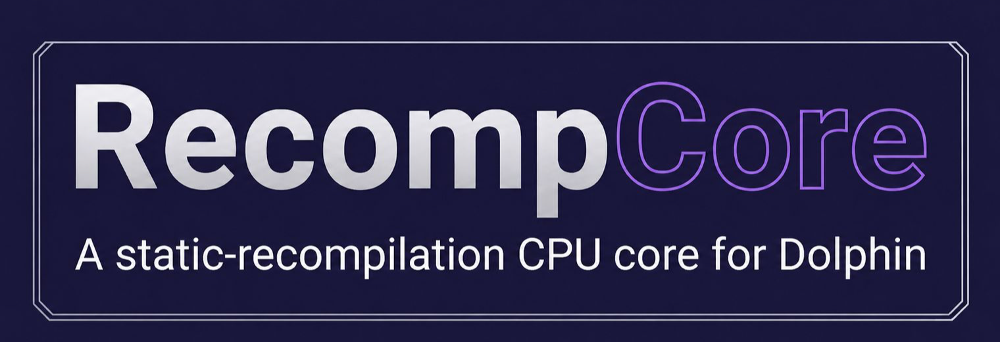

<p align="center"></p>

# RecompCore

[](https://github.com/aharonahdoot/RecompCore/actions/workflows/build.yml)
License: GPL-2.0-or-later ·
[Discussions](https://github.com/aharonahdoot/RecompCore/discussions)

**RecompCore** is a Dolphin fork with one addition: a CPU core that runs
statically recompiled GameCube code. You run your own copy of a game through
[DolRecomp](https://github.com/ExpansionPak/DolRecomp), compile the output into
a native module, and RecompCore loads it by disc ID at boot. Code the module
covers runs as ordinary native functions — no JIT, no interpreter. Everything
else — graphics, audio, discs, controllers, and any code the module doesn't
cover — is still Dolphin, unchanged.

With no module present, RecompCore behaves exactly like stock Dolphin, for any
ISO. With a module, the worst case is falling back to Dolphin's interpreter:
slower, never broken.

## Why

Two reasons, honestly stated.

First, platforms where JITs aren't allowed. This architecture needs none: the
game's code is compiled ahead of time, on your machine, by an ordinary C
compiler.

Second, a referee for recompiler correctness. RecompCore has a lockstep mode
that reruns every dispatch on Dolphin's interpreter and compares full CPU
state. When native code and the interpreter disagree, one of them is wrong —
and we find out which. This is how the recompiler's floating-point unit was
brought to bit-exactness.

This work stands on a lineage: [Dolphin](https://dolphin-emu.org/) (the
hardware model everything here runs on),
[DolRecomp](https://github.com/ExpansionPak/DolRecomp) (the GameCube static
recompiler), [N64Recomp](https://github.com/N64Recomp/N64Recomp) and
Zelda64Recomp, [XenonRecomp](https://github.com/hedge-dev/XenonRecomp) and
UnleashedRecomp, ReXGlue, and rexdex.

## Status

Verified with Super Mario Strikers (G4QE01) as the first module:

| Measure | Result |
|---|---|
| Native dispatch coverage | 99.908% (24.30B native / 22.3M fallback, full game session) |
| Lockstep differential | 0 divergences over 37.7B dispatches (boot through a full match) |
| Speed vs stock JIT | ~real-time (97–100% by scene); the JIT keeps ~3.8× headroom |
| Module-less invariant | re-proven on two unrelated titles (native=0, stock behavior) |
| Savestates | round-trip mid-match |
| Recompiler oracle suite | 239 differential cases, 0 unexpected |

The ~3.8× dispatch-headroom gap against the JIT is the headline roadmap item.

## How it works

```
your ISO → main.dol → DolRecomp → C files → clang → g<GAMEID>_recomp module
                                                          │
              RecompCore autoloads by disc ID ────────────┘
                     │
        covered PC?  ├─ yes → native function
                     └─ no  → Dolphin interpreter (transparent fallback)
```

The module ABI is versioned (currently **v2**); the loader rejects a module
built against a different ABI rather than loading it wrong.

## Getting started

1. Build RecompCore — recipes in [CHASSIS.md](CHASSIS.md). The no-Qt build:

   ```sh
   cmake -B build -GNinja -DCMAKE_BUILD_TYPE=Release -DENABLE_QT=OFF -DENABLE_NOGUI=ON -DUSE_MGBA=OFF
   ninja -C build dolphin-emu-nogui
   ```

2. Package a module. For Super Mario Strikers, follow
   [StrikersRecomp](https://github.com/aharonahdoot/StrikersRecomp) and run its
   `tools/package_module.sh`. For any other game, see
   [module-template/](module-template/README.md).

3. Run with the StaticRecomp core:

   ```sh
   ./build/Binaries/dolphin-emu-nogui -e your.iso -C Dolphin.Core.CPUCore=6
   ```

   The config kill-switch `-C Dolphin.Core.StaticRecompModule=False` runs the
   same core interpreter-only, without touching the module file.

You bring your own ISO. Nothing game-derived ships in this repository or its
releases, and module binaries must not be redistributed.

## Roadmap

- Close the dispatch-headroom gap against the JIT (block linking, an inlined
  flat-RAM fast path — both gated on the oracle suite and the lockstep
  differential).
- Qt GUI verification (nogui is what's verified so far).
- Windows CI and verification (macOS and Linux build in CI today; macOS is
  the verified host).
- A second title.
- Periodic upstream rebases (policy in [CHASSIS.md](CHASSIS.md)).

Ecosystem: [GXRuntime](https://github.com/aharonahdoot/GXRuntime) is the
standalone native runtime built on the same CPU core and module ABI — the
lightweight path toward JIT-banned platforms.

## Relationship to Dolphin

The fork is thin by design: one new directory
(`Source/Core/Core/PowerPC/StaticRecomp/`) plus ~10 small seams in upstream
files, all listed in [CHASSIS.md](CHASSIS.md) with the sync policy. RecompCore
is not affiliated with the Dolphin project — please don't report RecompCore
bugs to Dolphin.

## FAQ

**Is this legal?** This repository is tools and emulator code only. You build
modules from your own copy of a game; nothing game-derived is distributed, and
built modules must not be shared.

**Is it faster than Dolphin?** No — parity without a JIT is the point today.
Dolphin's JIT keeps ~3.8× headroom in heavy scenes; closing that is the
roadmap.

**Why not upstream this into Dolphin?** It's a different execution model with
a per-game build step — better proven out in a fork first. The recompiler
fixes it surfaced are being upstreamed to DolRecomp.

**Which games work?** Any ISO boots stock-identical. Super Mario Strikers is
the validated module; [module-template/](module-template/README.md) covers the
rest.

**Wii?** DolRecomp decodes Broadway code, but Wii titles are untested here.

## Disclaimer, license, credits

This project is not affiliated with Nintendo or the Dolphin project. No game
code or assets are distributed — do not ask for or share them.

Licensed GPL-2.0-or-later, unchanged from upstream Dolphin (see
[COPYING](COPYING)).

Credits: the Dolphin team (the hardware model everything here stands on, and
CachedInterpreter as the structural template), ExpansionPak (DolRecomp,
libPorpoise), Mr-Wiseguy and the N64Recomp ecosystem, hedge-dev
(XenonRecomp/UnleashedRecomp), ReXGlue (Tom Clay et al.), rexdex, encounter
(Aurora, dtk), yannicksuter (smstrikers-decomp, CC0), the Melee decompilation
project, and devkitPro.
